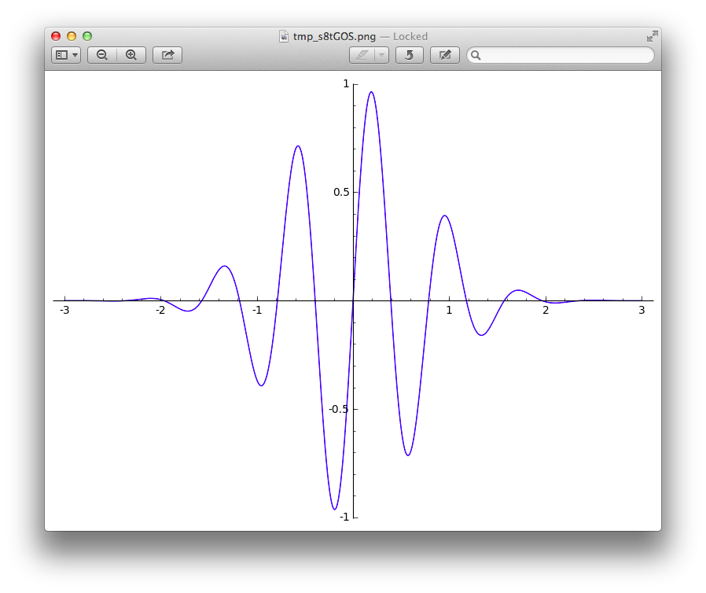

# Q1

### Plot Graph

```python
f = e^(-x) * sin(8 * x)
plot(f, -3, 3)
```



###以下是找出所有解的做法

```python
for i in range(1,20):
    tmp = 0.4 * (i)
    a = -3 + tmp
    b = -3 + tmp + 0.4f
    print "[(%s), (%s)] = %s" % (a, b, find_root(f, a, b))
```

### 結果
```bash
[(-2.60000000000000), (-2.20000000000000)] = -2.35619449019
[(-2.20000000000000), (-1.80000000000000)] = -1.96349540849
[(-1.80000000000000), (-1.40000000000000)] = -1.57079632679
[(-1.40000000000000), (-1.00000000000000)] = -1.1780972451
[(-1.00000000000000), (-0.600000000000000)] = -0.785398163397
[(-0.600000000000000), (-0.200000000000000)] = -0.392699081699
[(-0.200000000000000), (0.200000000000000)] = 3.05311331772e-16
[(0.200000000000000), (0.600000000000000)] = 0.392699081699
[(0.600000000000000), (1.00000000000000)] = 0.785398163397
[(1.00000000000000), (1.40000000000000)] = 1.1780972451
[(1.40000000000000), (1.80000000000000)] = 1.57079632679
[(1.80000000000000), (2.20000000000000)] = 1.96349540849
[(2.20000000000000), (2.60000000000000)] = 2.35619449019
[(2.60000000000000), (3.00000000000000)] = 2.74889357189
```

# Q2

```python
A = random_matrix(ZZ, 3, 4)
[  0   4   1   0]
[ -7  -2   1  -3]
[  0 -10  -3  11]

A.rref()
[    1     0     0 -30/7]
[    0     1     0  11/2]
[    0     0     1   -22]
```
結論：

$4y + z = 0 \\
-7x - 2y + z = -3\\
-10y - 3z = 11\\
x = -30/7,\ y = 11/2,\ z = -22
$

# Q3 

單純的 `sqrt(x)` 只是把那條方程式印出來，如果有切確的公式解，他會幫我們把答案找出來

而`N(sqrt(x))` 則是用逼近的方式，找出解答`19.8494332412792`