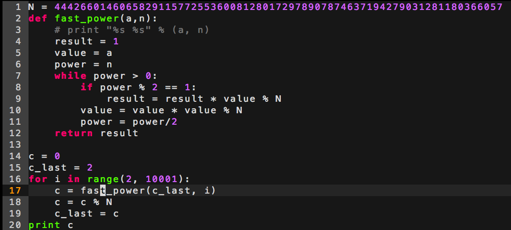
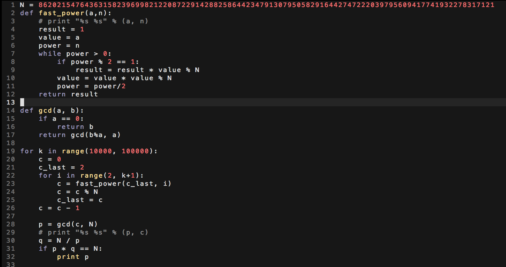

### ( 1 )

### answer : 58812549026446093187448687368681166977413687525857942745798800608369

### ( 2 )  $2^{1024}$ are all 6-smooth，但是$2^{1024}$不整除6!

### ( 3 ) 

#### answer : 

p = 58237079279233344183269762225028347515133736517633 q = 14801936469211262496713424888760656483543649615937